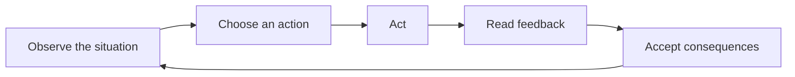
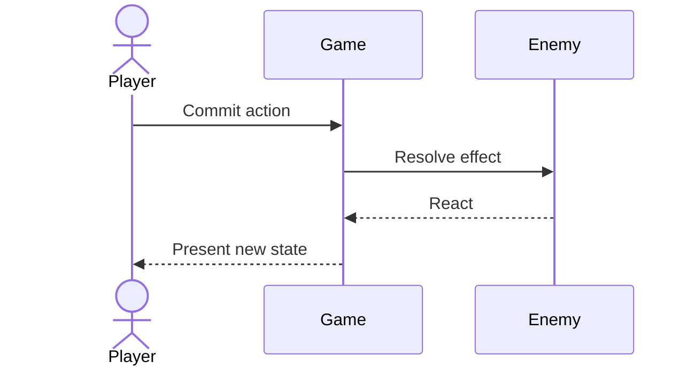
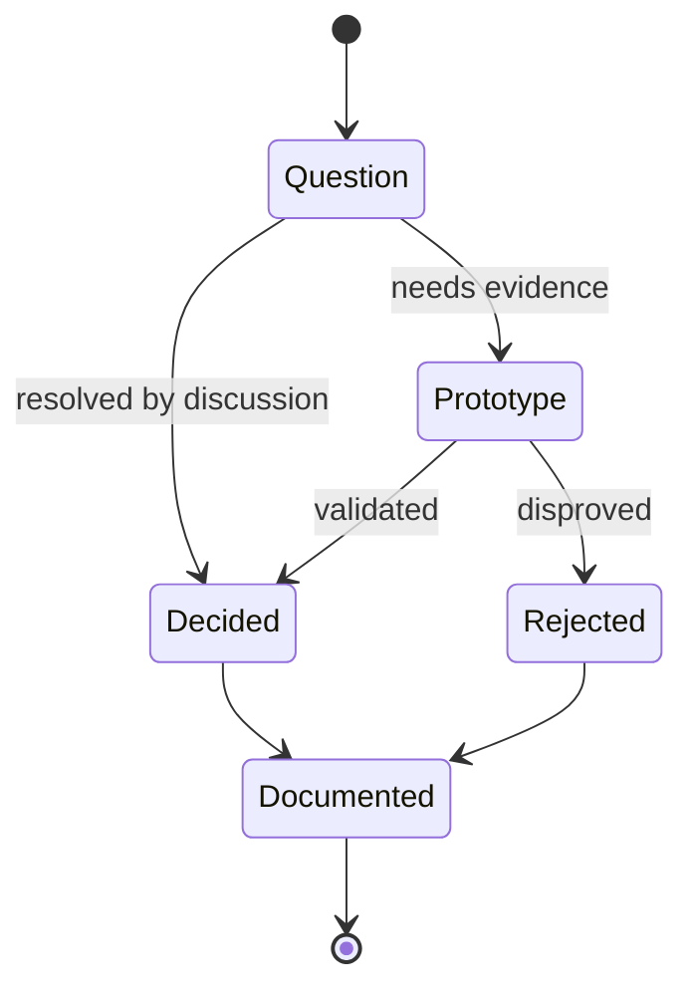

Mermaid diagrams are authored directly in Markdown with a fenced `mermaid` code block. These examples also suggest useful diagram types for the GDD.

## Core loop flowchart

Use flowcharts to show repeated player activity and the feedback connecting each step.

## Encounter sequence

Use sequence diagrams when timing and responsibility across actors matter.

## Production state

Use state diagrams to describe lifecycle rules without turning the GDD into a task checklist.

## Authoring note

Mermaid syntax errors fail visibly instead of silently falling back to a code block. See the [Mermaid documentation](https://mermaid.js.org/intro/) for supported diagram types and syntax.
