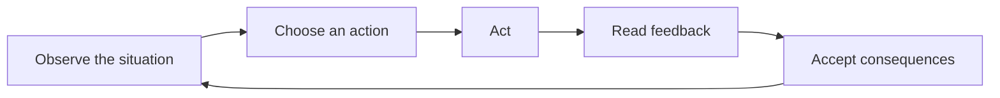
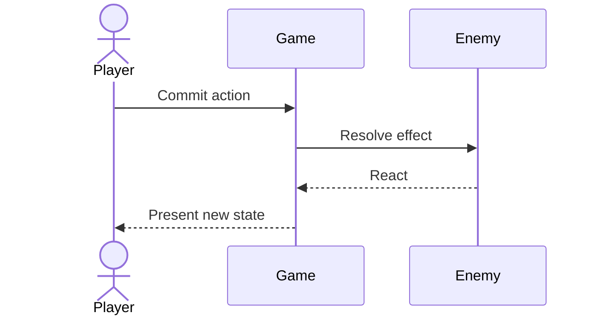
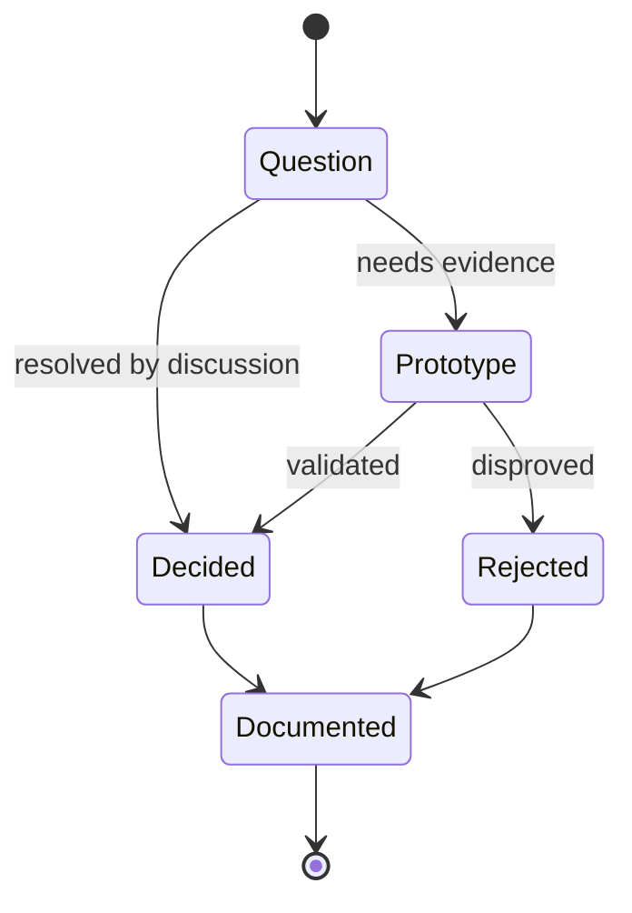
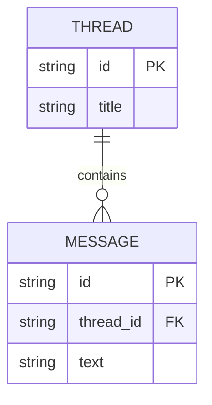
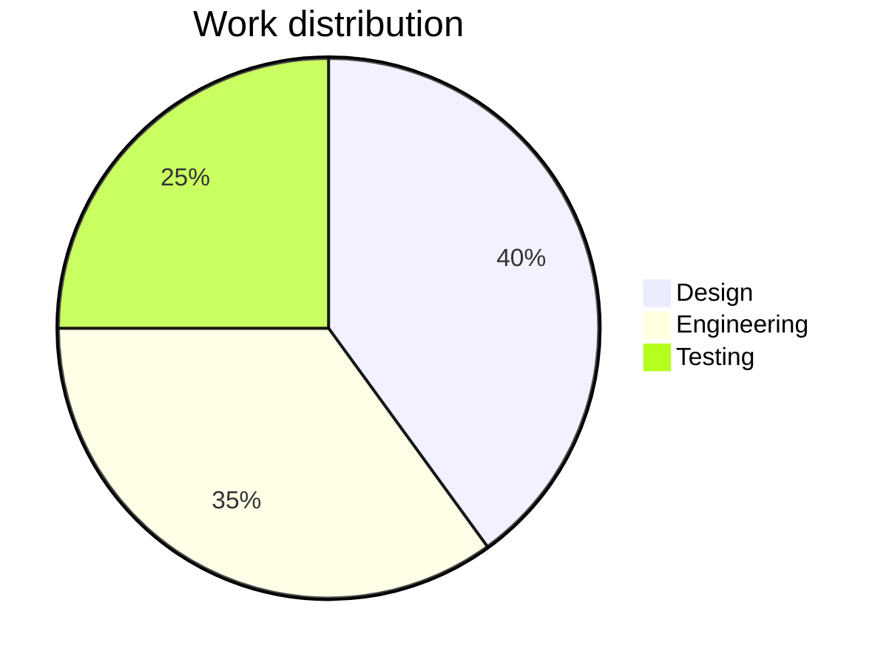
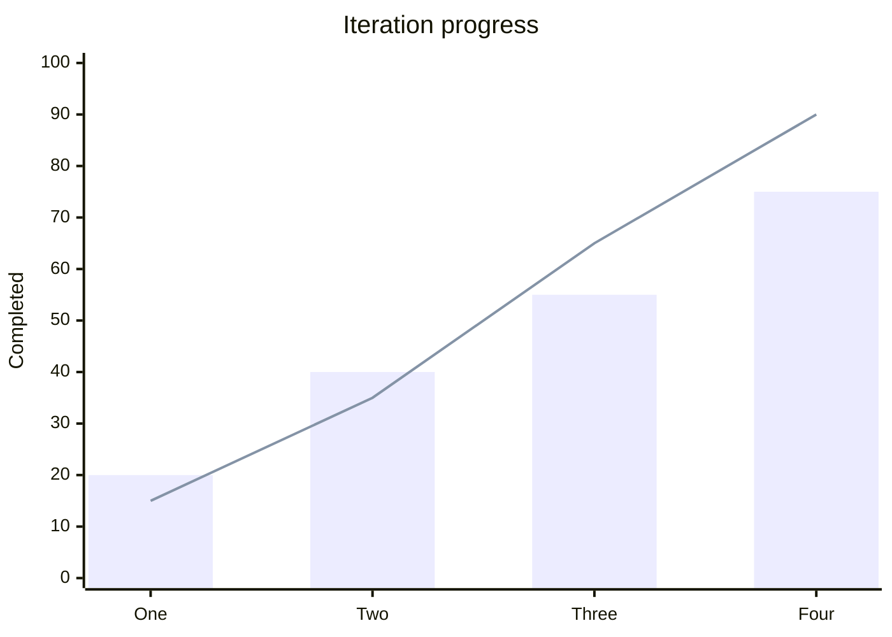

Mermaid diagrams are authored directly in Markdown with a fenced `mermaid` code block. These examples also suggest useful diagram types for the GDD.

## Core loop flowchart

Use flowcharts to show repeated player activity and the feedback connecting each step.

```mermaid
flowchart LR
    Observe[Observe the situation] --> Decide[Choose an action]
    Decide --> Act[Act]
    Act --> Feedback[Read feedback]
    Feedback --> Consequence[Accept consequences]
    Consequence --> Observe
```

## Encounter sequence

Use sequence diagrams when timing and responsibility across actors matter.

```mermaid
sequenceDiagram
    actor Player
    participant Game
    participant Enemy
    Player->>Game: Commit action
    Game->>Enemy: Resolve effect
    Enemy-->>Game: React
    Game-->>Player: Present new state
```

## Production state

Use state diagrams to describe lifecycle rules without turning the GDD into a task checklist.

```mermaid
stateDiagram-v2
    [*] --> Question
    Question --> Prototype: needs evidence
    Question --> Decided: resolved by discussion
    Prototype --> Decided: validated
    Prototype --> Rejected: disproved
    Decided --> Documented
    Rejected --> Documented
    Documented --> [*]
```

## Data schema

Entity/relationship diagrams use the same node, border, label, and connector tokens.

```mermaid
erDiagram
    THREAD ||--o{ MESSAGE : contains
    THREAD {
        string id PK
        string title
    }
    MESSAGE {
        string id PK
        string thread_id FK
        string text
    }
```

## Categorical chart palette

Pie slices use `--chart-1` through `--chart-8`; additional slices repeat the palette. Labels and borders use diagram tokens.

```mermaid
pie title Work distribution
    "Design" : 40
    "Engineering" : 35
    "Testing" : 25
```

## XY chart

Bar/line series share the same chart palette. Axes inherit `--diagram-line` and label tokens.

```mermaid
xychart-beta
    title "Iteration progress"
    x-axis [One, Two, Three, Four]
    y-axis "Completed" 0 --> 100
    bar [20, 40, 55, 75]
    line [15, 35, 65, 90]
```

## Authoring note

Mermaid syntax errors fail visibly instead of silently falling back to a code block. See the [Mermaid documentation](https://mermaid.js.org/intro/) for supported diagram types and syntax.
